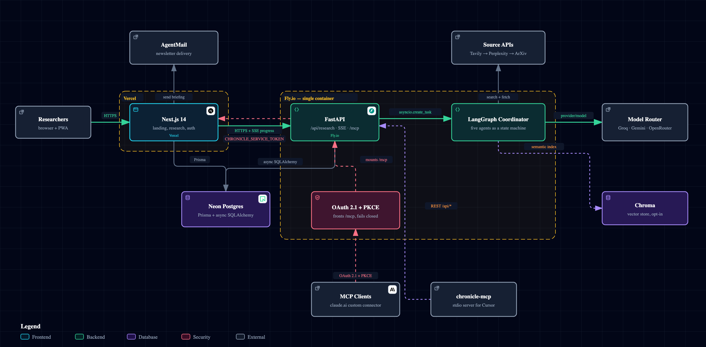

<div align="center">

# Chronicle

**AI research copilot for founders.**

Customer discovery, market sizing, competitive intel — in minutes, with citations you can defend.

[**Live demo →**](https://deep-research.intelliforge.tech) &nbsp;·&nbsp;
[API](https://multi-agent-deep-research-api.fly.dev/api/health) &nbsp;·&nbsp;
[About](https://deep-research.intelliforge.tech/about) &nbsp;·&nbsp;
[Source](https://github.com/gengirish/multi-agent-deep-research)

[](https://deep-research.intelliforge.tech)
[](https://deep-research.intelliforge.tech)
[](https://multi-agent-deep-research-api.fly.dev)
[](https://deep-research.intelliforge.tech)
[](https://www.python.org)
[](https://github.com/gengirish/multi-agent-deep-research)
[](#license)

</div>

---

## What it does

Founders run the same five research questions over and over — market sizing, competitive landscape, customer discovery, regulatory intel, recent funding activity. The current options are all bad: ChatGPT hallucinates citations, Perplexity gives you a paragraph instead of a report, and a real analyst costs $5k a week.

Chronicle runs the question through a **multi-agent pipeline** that searches the web, papers, and news; **scores every source** for credibility; **flags contradictions**; and assembles a **cited markdown report** you can paste into a deck or send to YC.

It shows its work. Every step the agents take is visible, recorded, and replayable.

**MCP-native:** install the Chronicle MCP server and run cited market research directly from Cursor or Claude Desktop while you write your deck or YC application. See [`mcp/README.md`](./mcp/README.md).

## Try it

```
https://deep-research.intelliforge.tech
```

No signup. No API key. Click a starter query, watch the five agents run, get a cited report.

## How it works

```
Query  →  Retriever  →  Enricher  →  Analyzer  →  Insight  →  Report
            │              │             │            │           │
            ▼              ▼             ▼            ▼           ▼
        Tavily +        metadata,    credibility    trend       cited
        Perplexity      sentiment,   scoring,       chains,     markdown
        + ArXiv         dates        contradictions hypotheses  report
```

Five specialized agents, orchestrated as a [LangGraph](https://github.com/langchain-ai/langgraph) state machine. The frontend streams progress over Server-Sent Events so you watch the chain assemble live.

| Agent              | Job                                                                          |
| ------------------ | ---------------------------------------------------------------------------- |
| **Retriever**      | Pulls candidate sources from web search, news APIs, and arXiv.               |
| **Enricher**       | Adds metadata, dates, source-type classifications, and sentiment.            |
| **Analyzer**       | Scores credibility, surfaces contradictions, extracts load-bearing claims.   |
| **Insight**        | Turns claims into hypotheses, trend chains, and reasoning steps.             |
| **Report builder** | Compiles everything into a structured, cited markdown report.                |

Retrieval has two modes. By default the retriever fires one query at three
channels and stops. Set `RESEARCH_LOOP_ENABLED=true` and it runs a
search → reflect → search-again loop instead, borrowed from LangChain's
[open_deep_research](https://github.com/langchain-ai/open_deep_research): the
model names what is missing, the retriever chases it, and the results are
de-duplicated and capped before they go downstream. Bounded on purpose — at the
defaults it costs 2 extra model calls and 12 extra searches per run.

Credibility is not just a URL pattern and a model's opinion. Papers (and any web
result carrying a DOI) are resolved against [OpenAlex](https://openalex.org) for
citation count, venue and the retraction flag, so a 400-citation paper is no
longer indistinguishable from a preprint nobody read, and a retracted paper is
floored rather than trusted. Free, no API key, and a lookup failure leaves the
score untouched.

## Architecture

<div align="center">

<picture>
  <source media="(prefers-color-scheme: dark)" srcset="docs/diagrams/chronicle-architecture-dark.png">
  <source media="(prefers-color-scheme: light)" srcset="docs/diagrams/chronicle-architecture-light.png">
  
</picture>

<sub>
  <a href="https://raw.githack.com/gengirish/multi-agent-deep-research/main/docs/diagrams/chronicle.architecture.html"><b>Open the interactive version →</b></a>
  &nbsp;·&nbsp; search nodes, trace a route, jump straight to the source line
  &nbsp;·&nbsp; <a href="./docs/diagrams/chronicle-architecture-dark.svg">SVG</a>
  &nbsp;·&nbsp; <a href="./docs/diagrams/chronicle.architecture.json">spec</a>
</sub>

</div>

Three deployables and two MCP surfaces. Next.js on Vercel owns auth, history and the
subscriber list; FastAPI on Fly.io runs the pipeline **inline** — `asyncio.create_task`,
not a worker process — and streams progress back over SSE. One Neon Postgres is reached
two ways: Prisma from the Next.js layer, async SQLAlchemy from FastAPI.

Two edges are worth reading closely. The **back-edge** from FastAPI into Next.js exists
because the subscriber list and mail credentials live in the web layer; a connector has no
browser cookie, so that call carries `CHRONICLE_SERVICE_TOKEN` instead. And `/mcp`
**fails closed** — without `CHRONICLE_MCP_ACCESS_KEY` it is never mounted and returns 404,
because an unauthenticated research tool spends real LLM credits. The stdio server takes
neither path: in remote mode it calls the plain REST endpoints.

Full detail in [`docs/ARCHITECTURE.md`](./docs/ARCHITECTURE.md).

## Stack

| Layer        | Tech                                                                    |
| ------------ | ----------------------------------------------------------------------- |
| Frontend     | Next.js 14 (App Router), React 18, TypeScript, D3 (visualizations)      |
| Backend      | FastAPI, uvicorn, LangChain, LangGraph (inline asyncio execution)       |
| Models       | Google (Gemini Flash), Groq (Llama 3.3 70B), OSS failover via OpenRouter |
| Search       | Tavily (primary), Perplexity (fallback), ArXiv                          |
| Storage      | Neon Postgres (Prisma); Chroma vector store (opt-in)                    |
| Email        | AgentMail (transactional + newsletter broadcast)                        |
| Hosting      | Vercel (frontend), Fly.io (backend, container)                          |
| Bibliographic| OpenAlex — citation counts, venue, retraction flags (free, no key)       |
| Tracing      | Langfuse — per-stage spans with token counts and cost (optional)         |

The model mix is cost-optimized: each agent runs on the smallest model that does its
job, and every default sits on a provider free tier. `OPENROUTER_FALLBACK_MODEL` is an
invoke-time safety net for any stage whose primary rate-limits — point it at a real
paid-but-cheap slug such as `openai/gpt-oss-20b`. OpenRouter has **retired its `:free`
model variants**, so a `:free` slug there now 404s on every call and makes the fallback
silently useless; the app probes the fallback once at startup and logs loudly if it is
unusable. Point `ANALYZER_MODEL` at Claude when you want stronger reasoning and have credit.

Keep the analyzer, insight and report stages on at least two different providers: Google's
free tier is 20 requests per day *per model*, so aiming all three at Gemini caps the whole
system at roughly six runs a day.

## Run it locally

### Backend

```bash
python -m venv venv && source venv/bin/activate     # Windows: venv\Scripts\activate
pip install -r requirements.txt
cp env.example .env
# edit .env: ANTHROPIC_API_KEY + GOOGLE_API_KEY (required), TAVILY_API_KEY (recommended),
#            GROQ_API_KEY / OPEN_ROUTER_KEY / PERPLEXITY_API_KEY (optional)
uvicorn backend.main:app --reload --host 0.0.0.0 --port 8000
```

### Frontend

```bash
cd frontend
npm install
cat > .env.local <<'EOF'
NEXT_PUBLIC_API_URL=http://localhost:8000
NEXT_PUBLIC_APP_URL=http://localhost:3000
DATABASE_URL=postgresql://...        # Neon; needed for auth, history and the newsletter
JWT_SECRET=dev-secret-change-me      # must match the backend's JWT_SECRET
EOF
npm run dev
```

Open http://localhost:3000.

### With Docker

`docker compose up` builds the backend from the same `Dockerfile` Fly.io uses and
serves it on port 8000. The frontend is not containerised — run it on the host as
above.

## Deploy

The live deployment uses Vercel + Fly.io. Both are CLI-driven; full walk-through in [`DEPLOYMENT.md`](./DEPLOYMENT.md).

```bash
fly deploy --app <your-app-name> --remote-only          # backend
vercel --prod --yes                                     # frontend
```

The repo is platform-agnostic — anything that can run a Python ASGI container will host the backend. See `Dockerfile` and `fly.toml`.

## Project layout

```
.
├── agents/                 # Retriever, enricher, analyzer, insight, reporter
├── orchestration/          # LangGraph workflow (coordinator.py)
├── utils/                  # LLM config, RAG service, agent logging
├── backend/                # FastAPI server
│   ├── main.py             #   app entrypoint, CORS, SSE, /mcp mount
│   ├── mcp_server.py       #   hosted MCP surface (FastMCP)
│   ├── auth/oauth.py       #   OAuth 2.1 + PKCE for the claude.ai connector
│   └── tests/              #   pytest suite
├── mcp/                    # `chronicle-mcp` stdio server (pip-installable)
├── eval/                   # Grounding / latency eval harness + LLM-judge layer
├── frontend/               # Next.js 14 App Router app
│   ├── app/(app)/          #   research, history, audience, settings, about
│   ├── app/(auth)/         #   sign-in, sign-up, password reset
│   ├── app/newsletter/     #   public newsletter sign-up page
│   ├── app/api/            #   auth, subscribe/confirm, subscribers/import,
│   │                       #   unsubscribe, reports (route handlers)
│   ├── src/views/          #   page-level React components
│   ├── src/components/     #   including D3-based visualizations
│   └── prisma/             #   Postgres schema (users, subscribers, reports)
├── Dockerfile              # Backend container (used by Fly.io)
├── fly.toml                # Fly.io deployment config
├── docker-compose.yml      # Local backend dev stack
└── DEPLOYMENT.md           # Step-by-step deploy guide
```

## Configuration

| Variable             | Required | Purpose                                          |
| -------------------- | :------: | ------------------------------------------------ |
| `OPEN_ROUTER_KEY`    |    ➖    | Fallback for every provider; needed only when a native key is absent |
| `GOOGLE_API_KEY`     |    ✅    | Analyzer, insight and report stages (Gemini Flash) |
| `GROQ_API_KEY`       |    ✅    | Retriever and credibility stages                 |
| `ANTHROPIC_API_KEY`  |    ➖    | Optional: better analysis via Claude when funded  |
| `TAVILY_API_KEY`     |    ➖    | Web search (recommended; falls back if missing)  |
| `PERPLEXITY_API_KEY` |    ➖    | Search fallback                                  |
| `ALLOWED_ORIGINS`    |    ➖    | Comma-separated CORS allowlist                   |
| `ENVIRONMENT`        |    ➖    | Free-form environment label                      |
| `PORT`               |    ➖    | Server port (host injects in production)         |

Enabling the hosted claude.ai connector additionally needs `CHRONICLE_OAUTH_SECRET`
(or `JWT_SECRET`) **and** `CHRONICLE_MCP_ACCESS_KEY`; broadcasting from it needs
`CHRONICLE_SERVICE_TOKEN` and `CHRONICLE_APP_URL`. The Next.js layer has its own set
(`DATABASE_URL`, `JWT_SECRET`, `AGENTMAIL_API_KEY`, `NEWSLETTER_ADMIN_EMAILS`, …).
`env.example` is the authoritative, commented list for both — this table is the short
version.

`*.vercel.app` preview origins are auto-allowed via regex in `backend/main.py`.

## MCP (Cursor / Claude Desktop)

Chronicle ships **two** MCP surfaces: a local stdio server (below) and a hosted
remote connector for claude.ai (next section). They expose the same six tools and
are kept in sync by `backend/tests/test_mcp_parity.py`.

| Tool | Purpose |
| ---- | ------- |
| `research_market` | Run the full multi-agent pipeline on a query (~30–90s) |
| `get_research_job` | Fetch a job by ID (use to poll an `async_mode=true` run) |
| `export_research_markdown` | Export a completed job as markdown |
| `list_starter_queries` | Founder-style example queries |
| `broadcast_briefing` | Email a finished Chronicle report to the newsletter list |
| `broadcast_custom_briefing` | Email an externally-composed briefing (subject + HTML) to the list |
| `chronicle_health` | API + database connectivity check |

Every tool but the two `broadcast_*` ones is read-only. Those two are marked
`destructiveHint` and **send real email**: call with `confirm=false` first to get a
recipient count, then again with `confirm=true` only on an explicit human go-ahead. Each
send identity can be broadcast once, ever — a repeat returns `already_broadcast` and
sends nothing, so a retried agent run is safe.

### Broadcasting an externally-composed briefing

`broadcast_briefing` mails a *Chronicle research report* — it needs a job ID and
renders that report's markdown. The daily "IntelliForge Morning Briefing" is not
a research report: it is a news digest assembled by a scheduled job outside
Chronicle, which arrives as finished HTML. That send has its own endpoint:

```
POST /api/newsletter/broadcast
```

An agent reaches that endpoint through `broadcast_custom_briefing`, which takes
the same fields (`subject`, `html`, optional `text` and `segment`, plus a
`dedupe_key`) behind the same confirm-first gate. The scheduled job that writes
the digest talks to Chronicle only over MCP, so the tool — not a direct POST —
is how the daily send actually happens.

| Field | | |
| ----- | - | - |
| `subject` | required | 1–200 characters |
| `html` | required | the finished body; a per-recipient unsubscribe footer is appended before sending |
| `text` | optional | plaintext alternative |
| `segment` | optional | one segment tag; omit for the whole list |
| `dryRun` | default `false` | returns the recipient count and sends nothing |
| `dedupeKey` | required | `^[a-z0-9:_-]{3,64}$`, e.g. `daily-briefing:2026-09-09` |

Authentication is the same as the report broadcast: a browser session (gated by
`NEWSLETTER_ADMIN_EMAILS`) or a `CHRONICLE_SERVICE_TOKEN` bearer token, which is
how the scheduled job calls it. Set that token in the Chronicle Vercel
environment before the first run — see [`DEPLOYMENT.md`](./DEPLOYMENT.md).

Because there is no report ID to key on, **`dedupeKey` is the send-once
identity**. It is stored in the same `broadcasts` audit table the report route
uses, scoped per (`dedupeKey`, `segment`) — so a retried scheduled run returns
`409 already_broadcast` and mails no one twice. Dating the key
(`daily-briefing:YYYY-MM-DD`) gives one issue per day for free.

```bash
# Dry run first — reports the recipient count, sends nothing.
curl -sS -X POST https://deep-research.intelliforge.tech/api/newsletter/broadcast \
  -H "Authorization: Bearer $CHRONICLE_SERVICE_TOKEN" \
  -H "Content-Type: application/json" \
  -d '{
        "subject": "IntelliForge Morning Briefing — 9 Sep 2026",
        "html": "<html><body><h1>Today in AI</h1><p>…</p></body></html>",
        "dedupeKey": "daily-briefing:2026-09-09",
        "dryRun": true
      }'
# {"ok":true,"dryRun":true,"recipientCount":7,"segment":null,...}

# Then the real send: same call with "dryRun": false.
```

```bash
pip install -e mcp/
```

Add to `.cursor/mcp.json`:

```json
{
  "mcpServers": {
    "chronicle": {
      "command": "python",
      "args": ["-m", "chronicle_mcp"],
      "env": {
        "CHRONICLE_API_URL": "https://multi-agent-deep-research-api.fly.dev"
      }
    }
  }
}
```

Then ask Cursor: *"Use Chronicle to research TAM for AI coding assistants 2025."*

Full setup: [`mcp/README.md`](./mcp/README.md).

## claude.ai remote connector

The deployed backend also serves a hosted MCP endpoint at `/mcp`, fronted by an
OAuth 2.1 authorization server, so claude.ai can use Chronicle without any local
install.

**Add it:** claude.ai → Settings → Connectors → Add custom connector →

```
https://multi-agent-deep-research-api.fly.dev/mcp
```

Claude handles dynamic client registration and PKCE automatically. The approval
screen asks for a shared access key (`CHRONICLE_MCP_ACCESS_KEY`), which the
operator sets — see [`DEPLOYMENT.md`](./DEPLOYMENT.md) Phase 3.

The endpoint **fails closed**: without both a signing secret and an access key
it is never mounted and `/mcp` returns 404. A 404 means "not configured", not
"broken"; a correctly configured endpoint returns **401** with a
`WWW-Authenticate: Bearer resource_metadata="…"` challenge.

Because `research_market` takes 30–90s, ask for `async_mode=true` and poll
`get_research_job(job_id)` rather than waiting inline.


## Newsletter

Chronicle can mail a finished briefing to a subscriber list, so a research run
becomes a published issue rather than a one-off answer.

- **Sign-up** has a page of its own at
  [`/newsletter`](https://deep-research.intelliforge.tech/newsletter) — that is
  the link to share. The landing page also carries the form inline at
  `#newsletter`, and every shared report footer has a compact version. All three
  post to `POST /api/subscribe`.
- **Double opt-in.** A public sign-up is stored `PENDING` and mailed a 48-hour
  confirmation link; only clicking it makes the address `ACTIVE`. Broadcasts read
  `ACTIVE` rows only, so an unconfirmed address cannot receive mail. Addresses the
  owner adds by hand or imports from CSV skip this — the owner is asserting
  consent. Set `NEWSLETTER_DOUBLE_OPT_IN=false` to disable it locally.
- **The list** lives in Postgres and is managed at `/audience` in the app: add
  people, import a CSV, and tag them into segments.
- **Segments** are free-form tags on a subscriber. Broadcasting takes an optional
  `segment`, so one report can go to `investors` and later to `beta` — the
  send-once guard is scoped per (report, segment), not per report.
- **Sending** goes through AgentMail, with a per-recipient one-click unsubscribe
  token in every message.
- **Triggering** works from the report view in the UI, or from an agent via the
  `broadcast_briefing` MCP tool. A briefing composed *outside* Chronicle (the
  daily news digest) goes out through `broadcast_custom_briefing` / `POST
  /api/newsletter/broadcast` instead, with a caller-supplied `dedupeKey` as its
  send-once identity.

> **`NEWSLETTER_ADMIN_EMAILS` is a security control, not a convenience.** When it
> is unset, `isNewsletterAdmin()` returns `true` for *every* authenticated user —
> anyone who can sign in can read the subscriber list (PII) and mail it. That open
> default suits a single-operator deployment; set the variable before publicising
> any signup link. See [`DEPLOYMENT.md`](./DEPLOYMENT.md).

## Roadmap

- [x] MCP server for Cursor / Claude Desktop (`chronicle-mcp`)
- [x] Hosted claude.ai remote connector (OAuth 2.1 + PKCE at `/mcp`)
- [x] Newsletter: sign-up page, double opt-in, segments, CSV import, broadcast
- [ ] Persistent project workspaces (save and revisit research threads)
- [ ] Direct export to Notion, Google Docs, and Linear
- [ ] Custom agent definitions (bring your own retrieval source)
- [ ] Team workspaces with shared research history
- [ ] Embedded citation viewer (Hebbia-style side-by-side)

## Docs

| Document | What it covers |
| -------- | -------------- |
| [`QUICK_START.md`](./QUICK_START.md) | Fastest local setup, with troubleshooting |
| [`DEPLOYMENT.md`](./DEPLOYMENT.md) | Vercel + Fly.io, the claude.ai connector, newsletter broadcast |
| [`docs/ARCHITECTURE.md`](./docs/ARCHITECTURE.md) | How it fits together and why |
| [`docs/diagrams/`](./docs/diagrams/) | The architecture diagram — interactive HTML, SVG, and the Archify spec it is generated from |
| [`docs/SCHEDULED_BRIEFINGS.md`](./docs/SCHEDULED_BRIEFINGS.md) | Scheduling unattended briefings, and the prompt to hand the claude.ai scheduler |
| [`mcp/README.md`](./mcp/README.md) | The local stdio MCP server |
| [`env.example`](./env.example) | Every environment variable, with free-tier limits |
| [`TODO.md`](./TODO.md) | Open items and known gaps |

## Contributing

Open an [issue](https://github.com/gengirish/multi-agent-deep-research/issues) or [PR](https://github.com/gengirish/multi-agent-deep-research/pulls). The code is intentionally small enough to read end-to-end in an afternoon.

## License

MIT — see header of source files. Use it, fork it, ship it.

---

<div align="center">

**Made by founders, for founders.** &nbsp;·&nbsp; [Live demo](https://deep-research.intelliforge.tech) &nbsp;·&nbsp; [GitHub](https://github.com/gengirish/multi-agent-deep-research)

</div>
